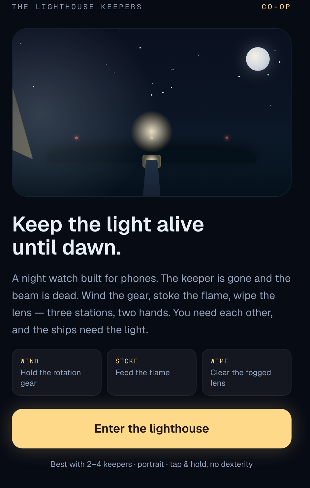
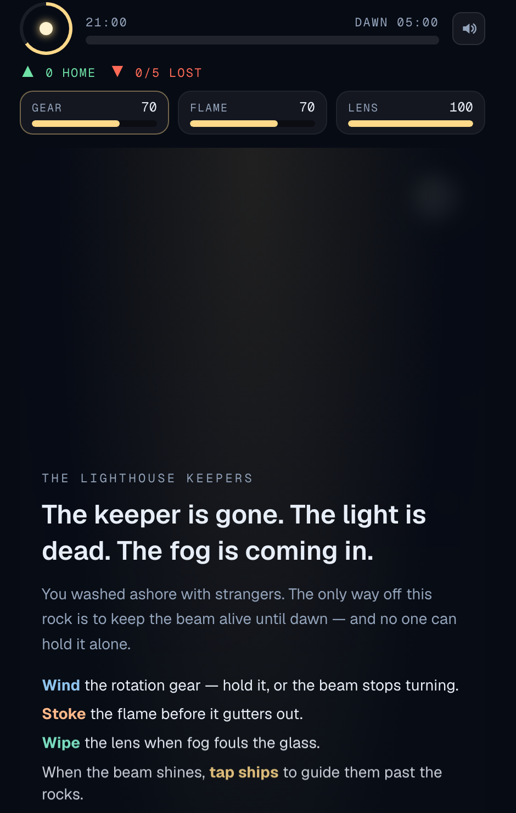

<div align="center">

# The Lighthouse Keepers

**A co-op night watch for mobile Decentraland.**
Keep the light alive until dawn. Nobody keeps it alone.

<br>


</div>

---

The keeper is gone and the beacon is dead. You and a few strangers wash ashore in
the fog. Three stations keep the light alive — the rotation **gear**, the
**flame**, the **lens** — and one pair of hands can't hold all three. Keep the
beam burning until dawn and guide the ships past the rocks. At first light a
message in a bottle washes up: a line left by a real group who kept the light
before you. You sign the logbook and leave one line for whoever comes next.

Built for the **Decentraland Friendzone Mobile Buildathon** (DCL Regenesis Labs).

<div align="center">

| Landing | The night watch |
|:---:|:---:|
|  |  |

*Screens from the web prototype — portrait, mobile-first.*

</div>

## Links

| | |
|---|---|
| 🌐 **Live World** | [decentraland.org/play?realm=djwaifu.dcl.eth](https://decentraland.org/play?realm=djwaifu.dcl.eth) |
| 🎮 **Web prototype** | `npm run dev` → [localhost:3000](http://localhost:3000) |
| 📄 **Pitch** | [`docs/PITCH.md`](docs/PITCH.md) |
| 🛠 **SDK7 port guide** | [`docs/SDK7-PORT.md`](docs/SDK7-PORT.md) |
| ✅ **What's left** | [`docs/PENDING.md`](docs/PENDING.md) |

## The game

One night is about **3½ minutes**.

1. **Briefing** — the fog is coming in. Split up: who has the gear, who has the flame, who watches the sea.
2. **Night** — three meters decay continuously. Walk to a station and tap: `Wind` the gear, `Stoke` the flame, `Wipe` the lens. Fog waves roll in on a timer and eat the lens fast.
3. **The beam** only shines when all three are above the line. While it shines, tap ships on the horizon to guide them home. While it's dark, ships break on the rocks — and you have **12 seconds** of grace before the night is lost.
4. **Dawn** — you made it. The World's all-time rescue counter ticks up. Draw a bottle message from a past group. Sign the logbook.
5. **Wreck** — too many ships lost, or the beam stayed dark too long. The fog takes the tower. The drowned keeper drifts through. Relight and try again.

## Built for mobile, built to be social

| Judging criterion | How the scene answers it |
|---|---|
| **Mobile-First** | Every action is one finger — walk to a station and tap, tap a ship. No dexterity, no multi-touch, portrait. Designed for the phone from the first sketch. |
| **Social Value** | The meters decay faster than one keeper can service. You physically divide the stations and call out what's slipping. No voice needed — the shared HUD and the beam going dark *are* the channel. |
| **Mobile UX** | Safe-area insets, large thumb-zone targets, `isMobile()` sizing, colour + shape + text for every state, a 4-line briefing you can't get wrong. |
| **Performance** | One parcel, primitives + a single beam mesh, 20 Hz render loop, snapshot netcode. |
| **Creativity** | Leads with a world and a mood — dread, fog, a failing light, a ghost — not a mechanic. |
| **Retention** | The World's running "souls guided home" counter you contributed to, the logbook your line stays in for strangers to read, bottle messages you only see by surviving. A natural "bring a friend, we need a third." |

Full breakdown in [`docs/PITCH.md`](docs/PITCH.md).

## Architecture

```
.
├── scene/              The submission — a Decentraland SDK7 scene
│   ├── src/
│   │   ├── engine.ts       pure game engine (decay, fog, ships, win/lose)
│   │   ├── state.ts        one syncEntity'd component = the whole night;
│   │   │                   authority election; logbook + all-time tally
│   │   ├── actions.ts      a tap on a station/ship writes the synced state
│   │   ├── world.ts        island, tower, sweeping beam, physical stations,
│   │   │                   ship entities synced to state each frame
│   │   ├── systems.ts      authority tick · beam spin · render · sound cues
│   │   ├── ui.tsx          React-ECS HUD + briefing/dawn/wreck overlays
│   │   └── feedback.ts     12 catalog audio clips through AudioSource
│   └── scene.json         title, tags, spawn point, worldConfiguration
├── src/                The web prototype (Next.js) — previews the loop & feel
└── docs/               requirements · pitch · port guide · pending work
```

**Multiplayer.** `syncEntity` (no server) keeps every keeper on the same night;
late joiners get the current state. The keeper whose wallet address sorts lowest
runs the authoritative tick — deterministic on every client, no messages,
survives joins and leaves. `crewFactor()` scales difficulty with player count so
a solo judge can still win a hard night. The logbook persists while ≥1 keeper is
in the scene; swapping it for a Multiplayer Server is a one-file change
([`docs/SDK7-PORT.md`](docs/SDK7-PORT.md) §3.2).

## Getting started

### The SDK7 scene

```bash
cd scene
npm install
npm run start              # preview in the Decentraland desktop client
npm run start -- --mobile  # QR code — preview on your phone (same Wi-Fi)
npm run build              # type-check + bundle
```

### The web prototype

```bash
npm install
npm run dev                # http://localhost:3000 — landing page + /play
```

## Deployment

Publishing to a Decentraland World needs a **World name** — a `*.dcl.eth`
Decentraland NAME on a wallet (100 MANA), a free one from the Friendzone Discord,
or an ENS `.eth` name you already own.

```bash
# 1. put the name in scene/scene.json → worldConfiguration.name
# 2.
cd scene && npm run deploy       # sign with the wallet that owns the name
# 3. live at decentraland.org/play?realm=<name>.dcl.eth
```

Full account/wallet walkthrough: [`docs/REQUIREMENTS.md`](docs/REQUIREMENTS.md) §1.

## Status

- **Web prototype** — complete, builds clean.
- **SDK7 scene** — engine ported; multiplayer sync, physical stations, sweeping
  beam, React-ECS HUD + overlays, logbook, and sound all built. Type-checks and
  bundles clean on `@dcl/sdk` 7.28.0. **Deployed** to `djwaifu.dcl.eth`. Not yet
  verified in the desktop/mobile client — that's next.

See [`docs/PENDING.md`](docs/PENDING.md) for the full checklist.

## Built with

[Decentraland SDK7](https://docs.decentraland.org) ·
[`@dcl/sdk/network`](https://docs.decentraland.org/creator/development-guide/sdk7/serverless-multiplayer/) ·
React-ECS · Next.js 16 · React 19 · Tailwind CSS 4

## License

Open source. Original work for the Friendzone Buildathon — see the buildathon
Terms & Conditions for submission conditions.
